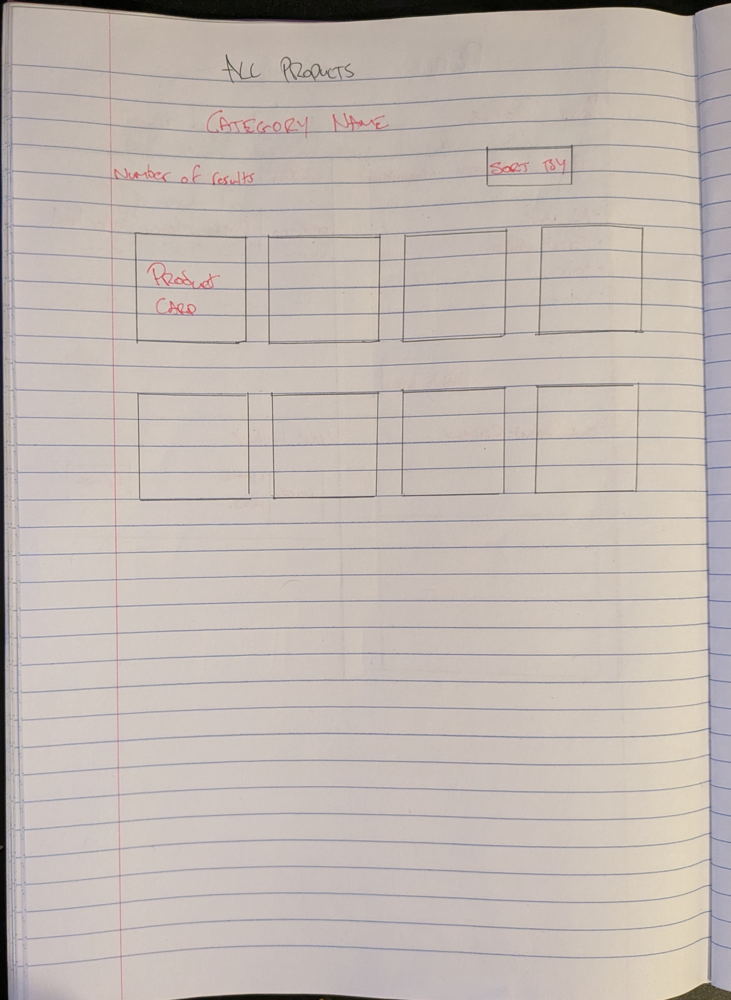
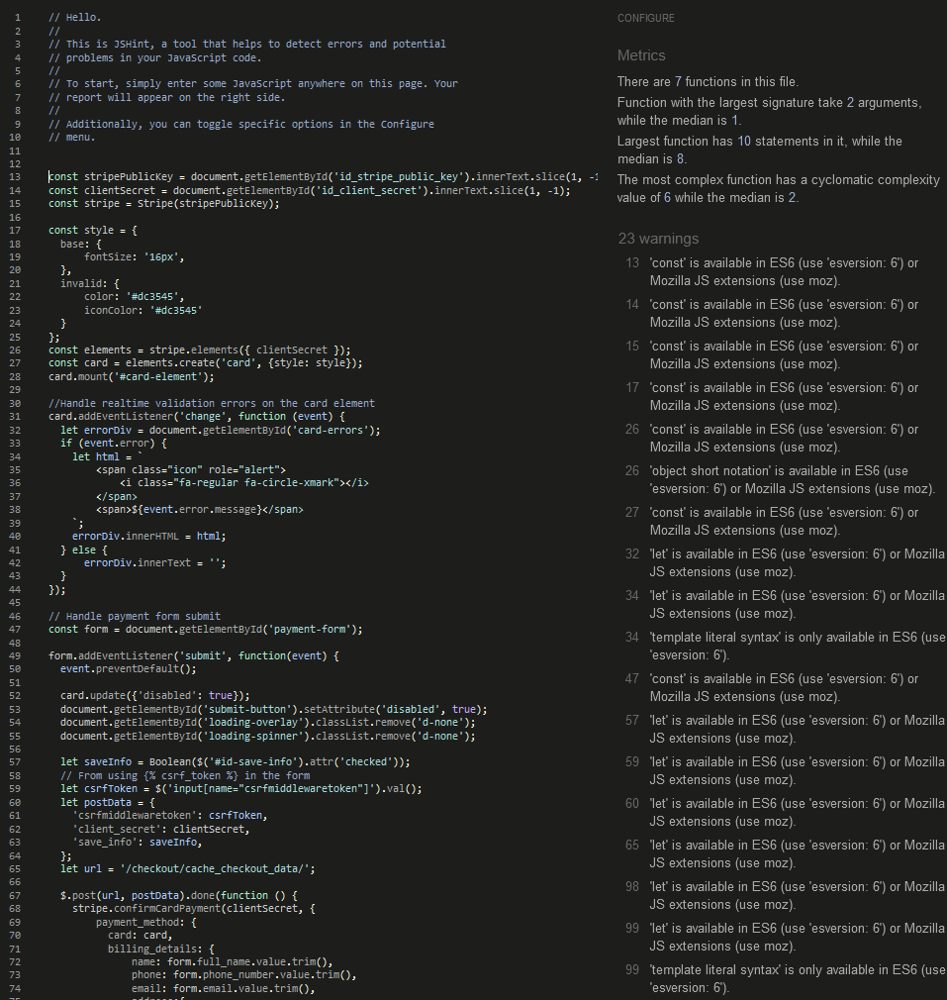

# The Salon Ecommerce

The Salon is a website that allows users to purchase products from a business called The Salon. The Salon is a hair salon that has decided to venture into selling the products they use to expand their business.

The aim of this website is to provide customers information on an array of various skin care, hair care and hair accessory products and give them an option to buy them through a stripe enabled checkout system. The Salon is a real business located in Shannon, Clare that is currently a hair and beauty salon that have in recent times started to sell the products they use physically in their salon and could actually use a site like this in the future. 

This project contains working Stripe functionality so when placing test orders use Stripes testing card number: 4242424242424242 with any CVV and expiry date.

- Live site:  [The Salon](https://the-salon-shop-de4e9ac0b4b8.herokuapp.com/).
- GitHub Repository:  [The Salon Repo](https://github.com/alexkavanagh-dev/the-salon-ecommerce).

## Features

### Navigation Menu

- The navigation menu is at the top of the page with a banner at the very top then search, logo and cart icon below and then finally navigation links at the bottom. 
- The Salon logo is in the center of the navbar and a navigation menu containing links to navigate the website is below the logo with a cart icon to the right and a search icon to the left.
- The navigation menu contains 5 items: 'Home', 'Skin Care', 'Hair Care', 'Hair Accessories' and 'Account'. 
- The account link in the menu is a dropdown menu that will show a login/signup link for unregistered users and a profile/logout link for registered users
- When the user is signed in as a superuser, the 'Admin Panel' link will also be shown to give easier access to the Django admin panel and a link to product management so they can add new products.
- The search icon contains a simple form in a popup modal menu to give users a way to search for specific terms in products on the site. 

### Hero Image

- Shows an image that will be the first thing a user sees to give an immediate impression of what The Salon is based around i.e. hair and beauty.
- The welcome message overlayed on the hero image reinforces and expands from the hero image impression to encourage the user to bring that salon hair feeling home by buying the products featured on the site.
- One brand colored button is overlayed on the hero image, labelled 'Shop all Products' giving the user a quick stand-out route to view all products available on the site. 

### Home Page

- Beyond the hero image there are sections on the homepage to highlight certain product sections, a mission statement section, postage information points section and featured brands section. 
- There are two featured products sections, one to highlight a brand and one to highlight cruelty free products. Highlighting specfic brands can encourage customers to see them in a better light if a trusted brand is pushing them forward and endorsing them, encouraging purchases. Cruelty free is a growing interest point for customers in recent years who care about animal welfare so this gives them a section to highlight those products. Each of these sections have a button linking them to all products for each. The buttons use a search query to bring up all related items for each. 
- The mission statement section states the goal of the business and gives a more caring, small business feel to the website as the mission statement is from the CEO and gives their name. 
- The postage information points sections highlights 3 important pieces  of information for customers about shipping for orders. It highlights that there is free shipping when you spend 60 or more, it shows who orders are posted with and it states that orders are shipping in eco friendly packaging that can be recycled. 
- The featured brands section highlights 4 seperate brands that the business works with showing their logo to build brand familiarity and they act as links to all products available from that brand. The links work similarly to the button from the featured brand section and make use of the search function. 

### Products page

- Shows a paginated list of products on the site with a thumbnail image, product title, product name, price and badges for products on sale, out of stock and cruelty free.
- Both the name and thumbnail act as links to the product detail page. The thumbnail has a zoom effect on hover to show it is interactive and similarly the name becomes underlined on hover.
-  The badges for sale, out of stock and cruelty free products all differ in color and position. The sale and out of stock badges wont show together and show in the top left corner with the cruelty free badge showing in the top right. The sale badge is using the brand pink color to fit in with the branding with the out of stock badge using bootstraps info color to help stand out without being an alarming color. The cruelty free badge uses a neutral grey color to indicate that a product is cruelty free at a glance without cluttering up the page. 
- The product page is paginated by 12 so it will display 12 products before additional products will be put on to seperate pages. When paginated, a next and previous button will show up to allow a user to navigate through the seperate pages.
- The products page can be filtered with categories using the links in the navigation menu and can be sorted by price, name and brand name.

### Product Detail Page

- This page displays a larger product image, more product information with a description, wishlist button, product reviews/ratings and a quantity selector with an add to cart button.
-  The wishlist button adds that product to the users wishlist which can be seen on their profile. When that item is already on the wishlist, clicking the icon will remove it from the wishlist instead. The icon will change color to represent an item that is already wishlisted by that user.
- If the user on product detail page is an admin, an edit and a delete button will appear to allow the user to edit the post or delete it. The edit button will bring the user directly to the edit product page while the delete button will bring up a modal to confirm that the user wishes to delete the product entirely. 
- Each post detail page has a review section for users with accounts to leave reviews with a number rating out of 5 about products.
- Reviews can be deleted by their author with a button that displays when that user is logged in. A modal will popup to confirm that the user wishes to delete their review , warning them that it cannot be undone.
- Number ratings from reviews will be averaged and displayed in the product information section under its name. 

### Cart/Checkout

- The cart page displays the products that are currently in the users cart with information like the products image, price, name, quantity of items, subtotal for the item, cart total, delivery fee and grand total of the order. 
- A quantity selector is present to change the amount in an order and a remove button to remove it entirely.
- There is a secure checkout button at the bottom to bring the user to the checkout page.
- The checkout page shows an order summary again and a form to fill out with shipping information and card information. 
- There is a button below the shipping information to save this information to the users profile to save time on future orders.
- Once filled out correctly, an order will be placed using stripe to accept payment and an order will be created in the database with the relevant shipping information and items in the order.

### Add/Edit Product Page

- This page allows admin users to fill out a form to add new or edit existing products on the site.
- There is a form that the user can fill out with the relevant fields from the product model to edit or make a new product.
- This is useful for admin users so they do not need to go into the admin panel to add new products. 

### Search

- The search popup in the navbar allows a user to submit a search query to check through products on the website.
- When a user submits a search, the model for Products is filtered down for fields that contain the users search query.
- Products are displayed in the same way as on the products page for all products or categories and can be sorted the same ways.

### Accounts

- Accounts on this website are handled by django allauth and allow users to make accounts using a username, password and email address.
- Making an account allows a user to interact with more features on the website such as leaving reviews and wishlisting products.
- Signed in users will gain access to a page called 'My Profile' under the account dropdown which will show all of that users past orders, default delivery information, their product reviews and their wishlist.

### Footer

- The footer contains links similar to the main navigation at the top of the page excluding the 'Accounts' dropdown.
- There is a section giving the business physical address, phone number and opening hours with a link to check out their facebook page below. 
- The last section of the footer is a newsletter sign up run through mail chimp that simply requires a users email address to sign up for a newsletter from the business to keep up with offers and news. 

### Newsletter

A user can sign up with their email address through a signup form in the footer for a newsletter from the business. This can be goodo for users to keep up with news, sales, exclusive offers and more. It is also great for a business to have a simple newsletter signup as it gives them an easy, quick way to interact with customers who are definitely interested in hearing more from them and can drive customers to return to the site and make more purchases. The newsletter is run through mailchimps free tier which is a great starting point for small businesses getting themselves out there without wanting to invest too much. 

### SEO

This website has been optimised for SEO by making use of meta tags in the header and keywords throughout the webpage without keyword stuffing. There are short-tail and long-tail keywords used in a keyword meta tag that were collected by trying to find common relevant words and searches to this website that people might use in google and could land this website in the top 10 search results. 

A robots.txt file was also put into the website to allow search engines to crawl the website which can improve your SEO ranking on google search. 

A sitemap.xml file, created using [xml-sitemaps](https://www.xml-sitemaps.com/), was also put into the website that contains a list of the websites pages and how they are linked. This can help googles robots crawl a website and understand its structure. Simply having a sitemap can also help boost your SEO ranking with google. 

### Possible future features

- One click sign up through social accounts
- Click and collect functionality for users who live nearby and could pick items up to save on delivery fees.
- Upload multiple images for products instead of just one, creating a gallery to provide users with better information. 
- Create a modal for images to popup and zoom in on for the product detail page.
- Allow users to delete their account.
- Display review ratings average on the all products page. 
- Show an estimated time of arrival for products that are out of stock to come back in stock.
- An inventory system to keep track of quantities of items in stock and change them when orders are placed. 
- An option to cancel orders or edit orders after being placed through the site.
- Add more confirmation stages to orders after they are placed such as items being picked, dispatched, out for delivery etc. 
- Report reviews for inappropriate content or being inaccurate. 

## Business Model

The business model for this shop is a B2C model. The customers order beauty products that are shipped to them through this website. Customers pay through Stripe integration in advance. On successful payment and an order is complete, the customer will recieve an email containing the details of their confirmed order. 

### Marketing

There are two marketing techniques being used for this store: Social Media Marketing and Email Marketing. Both of these can be done without any cost while still providing big benefits for a business.

#### Social Media Marketing

The best social media platform for marketing is Facebook, it still has by far the largest amount of users  and is used widely around the world. Facebook also make it incredibly easy to setup a business page and get started building your brand. Facebook do also have a paid way to boost your pages traffic but I have not used that for this project. Once a Facebook business page is made it can be used to make posts about the shop, new products, sales, etc to help customers keep up with your business and it can help remind your customers about your business making it more likely they will return. 

#### Email Newsletter Marketing

The other form of marketing, email newsletter, is another great low cost way of promoting your business and connecting with your customers. It is another easy to setup and quick way to get marketing with services like mailchimp. It can be done for free like I have in this project and can be used to send mass emails to interested customers who have signed up to keep them up to date with news, offers and products in your store. 

## Database Structure
The entity relationship diagram for the models of this website is below showcasing the fields in each model and the relationships between them where there are any. 

## Wireframes
I did the wireframes for this website by hand and I have pictures of them below. 
The main influence on the design and layout for this website was a shopify theme "Sense" for a similar type of store.

## User Stories & Epics
The Epics and User stories for this project were made and tracked using GitHubs projects page. User stories were sorted into the 5 Epics here:
- Administration
- Registration and Accounts
- Ordering and Checkout
- User Interface 
- SEO and Marketing

Each user story was sorted into the most relevant epic, given acceptance criteria to follow and then given tasks that must be completed to consider that user story finished. All the user stories can be viewed on the github projects page used here:  [GitHub Projects Page](https://github.com/users/alexkavanagh-dev/projects/8).

## Sprints
This project was completed using the following sprint timelines:

#### Sprint 1 (18/07 - 21/07)
- Project Planning
- Create Logo
- Decide on Color Scheme
- Website Design/Wireframes
- Create images list to be used
- Create product list
- User Stories/Github project board
- Plan database models

#### Sprint 2 (24/07 - 28/07)
- Django Setup
- Django Authentication
- Create base template
- Entity relationship diagram
- Navigation Bar

#### Sprint 3 (28/07 - 04/08)
- Products setup
- Products template
- Add products
- Update Bootstrap
- New logo
- Hero image

#### Sprint 4 (04/08 - 10/08)
- Filtering and search
- Product detail template
- Placeholder Image

#### Sprint 5 (14/08 - 18/08)
- Quantity selector
- Product Modifying
- Product Sorting
- Shopping Cart

#### Sprint 6 (21/08 - 25/08)
- Checkout
- Toasts
- Product Modifying
- Finish quantity selector

#### Sprint 7 (28/08 - 03/09)
- Stripe
- Profile App

#### Sprint 8 (04/09 - 08/09)
- Sort by brand
- Product admin
- 404 template
- Footer
- Favicon

#### Sprint 9 (11/09 - 15/09)
- Wishlist Items
- Item Availability
- Out of stock/cruelty free badges
- Sale Price functionality

#### Sprint 10 (18/09 - 22/09)
- Cruelty free homepage section
- Shipping points homepage section
- Featured brands homepage section
- FAQ Model
- Facebook page
- Deployment

#### Sprint 11 (24/09 - 26/09)
- Emails setup
- Newsletter with mailchimp
- README
- Testing
- SUBMIT!

## Testing

### Validator Testing

#### HTML

- No errors are found when run through the [W3C MarkUp Validator](https://validator.w3.org/) aside from some unnecessary javascript type attribute warnings which aren't vital.

#### CSS

- 1 error is found through [W3C CSS Validator](https://jigsaw.w3.org/css-validator/). It says the scale property does not exist but it is a property I found through W3 schools and appears to work as expected so I don't understand why it's showing as an error. 

#### Performance

- I confirmed through the lighthouse tester in chrome devtools that performance on the website is adequate.

#### Javascript
No errors are found when run through[JSHint](https://jshint.com/).

#### Python
No errors are found when run through the [Code Institude Python Linter](https://pep8ci.herokuapp.com/).

### Compatibility Testing

- I checked that the website functions as intended on different desktop browsers: Chrome, FireFox and Edge.
- I also checked the website functions properly on iphone and android devices.

### Responsive Testing

- I checked that the website is responsive, looks good and works well on different screen sizes as small as the iphone 5 using dev tools on a web browser.
- I checked that all links were still clickable throughout the page on mobile and brought you to the correct section of the page.
- I checked that images and elements display properly across different screen sizes.

### Manual Testing

| Test Label             | Test Action                   | Expected Result                                                                                                                                                      | Test Outcome |
|------------------------|-------------------------------|----------------------------------------------------------------------------------------------------------------------------------------------------------------------|--------------|
| View Product List          | Load Products Page | Products are listed with all correct information and image. Product list should be paginated when there is more than 12 posts. Products are filtered by category when a category is selected                                                                                      | PASS         |
| View Product Detail Page          | Click on a product title or thumbnail image    | The product detail page for the selected product will open with all correct information and reviews shown                                                                                                | PASS         |
| Add Product          | Click on Product Management in navbar as admin and fill out the form   | A page containing a form for information and image for the product will load. When filled out and submitted, that product will be added to the database and shown in the relevant section of the website                                     | PASS         |
| Edit Product          | Click the edit button on a product page as an admin    | A page containing a form for information and image for the product will load like the add product page. When filled out and submitted, that product will be changed in the database to reflect the changes submitted in the form                                                                                                 | PASS         |
| Wishlist products   | Click the wishlist button on the product detail page | The item will be added to the users wishlist, viewable on their profile, and the icon will change color to reflect the change. The item will be removed from the wishlist upon re-clicking.                                                                      | PASS         |
| Register an account |Go to the sign up page and fill out the sign up form  | Once the signup form is submitted, a user account will be made and for that user with the supplied username and password.                                                          | PASS         |
| Cruelty Free Product    | Set cruelty free to true for a product | When a product is set as cruelty free in the admin panel/add product page/edit product page, it will have a badge in the top right corner of its product card and on its product detail page.     | PASS         |
| Search Site | Enter search query into the search bar in the navbar/footer | The entered search term will be used to filter products and display them similar to the all products page.                                                               | PASS         |
| Place an Order         | Add items to cart and go through checkout process entering shipping and payment info to place order    | Items in the users cart along with the shipping information entered will be used to create an order in the database. The payment information entered will be used with the Stripe integration to charge the users card for their order.   | PASS |
| Delete product | Click delete button on product detail page | A modal to confirm that you want to delete the product will show and when delete in the modal is clicked, the product will be removed from the database                                                                    | PASS         |
   

  

### Fixed Bugs

- The modal for searching was not overlaying correctly above other content on the website. This was because of z-index not applying correctly due to its parent element not having default positioning in CSS. This was fixed by moving the modal out into the body element. 
- {{ MEDIA_URL }} was not working for images in templates. This was because I had not added the media context processor in settings and fixed by adding it.  
- Category filtering, search queries and sorting was not working with pagination as when you clicked onto the next page, the category and sorting was being lost in the request. This was fixed by adding special links to the pagination buttons to carry across queries, sorting and categories. 
- Pressing enter when the quantity selector field was highlighted would trigger the quantity counter to decrement. I fixed this by adding type="button" to the increment and decrement buttons
- There was an error occuring when the cart total was below the delivery threshold for decimals and floats being added together. This was because delivery was set as a float and everything else was in decimal format which cannot be added together. The fix was converting delivery to a decimal before adding it to anything. 
- There was an issue after deployment with account creation. I was able to make a superuser through the terminal and regular users through the deployed site and they would show up in the database, but they could not be logged into with a 500 error showing up. I did find some logs that looked similar to a previous issue I had in this project with the CountryField in django models where the max length would not go higher than 2 and I wanted the default value to be 'Ireland' which is obviously longer than 2. Previous to deployment I managed to get around this by manually changing the migrations to make the max length for CountryFields longer but this didn't seem to continue working beyond deployment. My fix to this was to just remove the default value in deployment and rebuild the database. 
  
### Unfixed Bugs

- The CSS validator gives me an error saying that the scale property doesn't exist but I found it on W3 schools and am using it in a way they recommend and it functions how I expect so I am not sure why it's being shown as an error. I decided to leave this as is since it doesn't seem to cause any issues. 

## Deployment

The website is currently deployed to Heroku.

The steps to deploy it were as follows: 
- Create/Login to Heroku account. 
- Create a new app in Heroku with a unique title. 
- Link that app to the related repository on github. 
- Add the necessary config vars: 
	- AWS_ACCESS_KEY_ID
	- AWS_SECRET_ACCESS_KEY
	- DATABASE_URL
	- EMAIL_HOST_PASS
	- EMAIL_HOST_USER
	- PORT
	- SECRET_KEY
	- STRIPE_PUBLIC_KEY
	- STRIPE_SECRET_KEY
	- STRIPE_WH_SECRET
	- USE_AWS
- In the deploy tab, select from either automatic deployment or manual deployment for your app. 

A requirements.txt file will need to be created and maintained in your repository so heroku knows what it needs to install when deploying so that your website will function correctly.  

Once deployed to Heroku with automatic deployment, the program will automatically update with new pushes to the repository. 

Alternatively, you can choose manual deployment below where you select automatic deployment if you only want to deploy after certain changes. 

This repository can be cloned by entering the command `git clone https://github.com/alexkavanagh-dev/the-salon-ecommerce.git` into the terminal of your chosen IDE.

The link for my repo on GitHub is here: https://github.com/alexkavanagh-dev/the-salon-ecommerce

  

## Credits

### Media

- Images for products came from  [Brown Thomas](https://www.brownthomas.com/) along with their names and descriptions. 
- There are icons used throughout the website from Font Awesome such as the search icon.
- The image used for the 404 error page came from [Vecteezy](https://www.vecteezy.com/vector-art/8892188-404-error-concept-for-landing-page)
- The image used for the hero image came from  [Unsplash](https://unsplash.com/photos/qJKT2rMU0VU)

### Code
- The  [Bootstrap Docs](https://getbootstrap.com/docs/5.3/getting-started/introduction/) was used from start to finish for the majority of the styling on the website
- The  [W3 Schools website](https://www.w3schools.com/) was a great reference as always through the whole project for explanations and examples on HTML, CSS, Javascript, Python and Django. The method of hiding arrows in the quantity selector was found on W3 Schools site. 
- The  [Mozilla developer docs](https://developer.mozilla.org/en-US/) was a great reference alongside the w3schools site for different explanations and examples when needed.
- The  [Django Docs](https://docs.djangoproject.com/en/4.2/) were how I figured out how to create most of the new features not covered in code institute tutorials and fix bugs related to views, models, urls, etc.

### Tools used

- [Pixlr](https://pixlr.com/) was used for any image editing needed in this project and to create a revision of the brand logo with the Foxymist font. 
- [Canva ](https://www.canva.com/en_gb/) was used to create the brand logo, favicon and placeholder image for products. 
- [ImageColorPicker](https://imagecolorpicker.com/en) was used to get the color code of pink used in the logo so it could be used across the site for uniformity. 
- [Favicon](https://favicon.io/) was used to create an appropriate size image for the favicon from the logo.
-  [Github](https://favicon.io/) was used for the repo of this project and its projects feature was used to keep track feature implementing.
- [Cloudconvert](https://cloudconvert.com/webp-converter) was used to convert images to webp format to minimize file size. 
- [LucidChart](https://www.lucidchart.com/pages/) was used to make the ERD diagram for models. 
